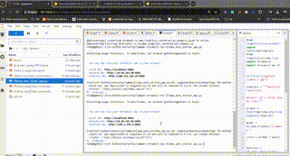

### Application Example of create children stories with LLMs

In this example, the application is powered by llama3.1.

## Environment setup:

		python -m venv .venv python=3.10.4
		pip activate .vevn
		python -m pip install --upgrade pip
		Install packages:
		pip install -r requirements.txt

## LLM setup:
Use this command to download the llama LLM model:

		ollama pull llama3.1 
        
## Run App:
		streamlit run Ollama_auto_stories_app.py
